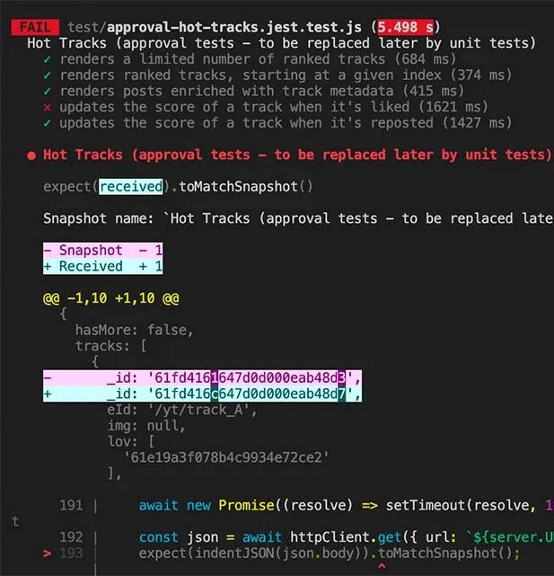
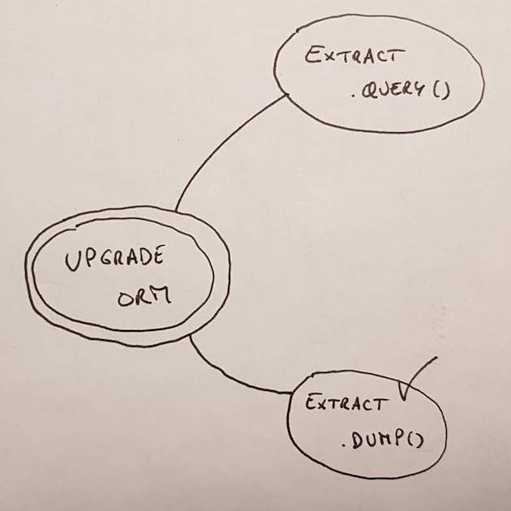
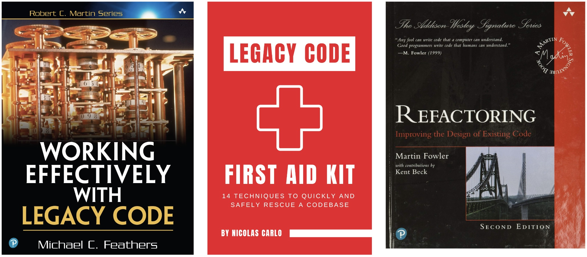

Journée à Thème

# **ShoLegacy & Refactoring**

---

## **Programme de la journée**

- 10h: Entrée en matière
- 11h: Techniques de découplage
- **12h: Déjeuner 🌮**
- 13h30: Techniques de refonte / décommissionnement
- 14h: Méthode d'analyse par l'historique git
- **15h: Pause ☕️**
- 15h30: Atelier pratique
- **18h: Retro + apéro 🍻**

---

## **Programme d'Entrée en matière**

1. Code legacy: un atout couteux pour l’entreprise

2. ReX: comment réussir/foirer son décommissionnement

3. Comment s’en sortir ?

---

> "**Legacy Code** is code without tests"

Michael Feathers

<!-- pas de tests => développement sans exemples et sans filet -->

---

> "Legacy Code is **valuable** code you’re afraid to change"

Nicolas Carlo & Alex Bolboaca

<!-- notion de peur mais aussi de valeur pour l'entreprise -->

---

> "A **code smell** is a surface indication that usually corresponds to a deeper problem in the system"

(Martin Fowler)

---

> "**Technical Debt** is the refactoring effort needed to add a feature non-invasively"

Michael Feathers

---

> "**Code refactoring** is the process of restructuring existing computer code without changing its external behavior"

---

## Problèmes pour les dévs ?

---

## Problèmes pour les dévs

- Difficultés pour faire **évoluer** le projet:
    - **complexité** accidentelle
    - manque de **documentation**
    - **stack** obsolète ou inconnue

- Bugs et régressions, trop tard

- Peur de modifier le code 😨

---

## ...et pour l’entreprise ?

---

## ...et pour l’entreprise

- attractivité et rétention des développeurs
- bus factor
- vélocité sur évolutions produit
- robustesse produit
- ⇒ risques & perte de compétitivité

---

Entrée en matière – 2/3

# **ReX: comment réussir/foirer son décommissionnement**

---

## **ReX: comment réussir/foirer son décommissionnement**

- Benoît: décommissionnement d’une ancienne techno
    <!-- ... qui s’est mal passé -->

- Adrien: décommissionnement de cache chez Choose
    <!--
    réussi, grâce à:
    - motivation forte de toute l’équipe de s’en débarrasser au plus vite
    - scope réduit
    - méthode progressive, avec accompagnement et outillage
    -->

- Fabien: emploi de DDD pour moderniser un legacy

- Réécriture from scratch, une bonne idée ?
<!--
cf ["Rewriting Legacy Code" by Anna Filina (@afilina)](https://www.youtube.com/watch?v=bTuvjjtGipY):
    - ça prend bcp bcp de temps
    - deux codebase à maintenir en parallèle: celle en prod (legacy) et celle en cours d'écriture
    - on risque de finir par répéter les mêmes erreurs dans la nouvelle codebase
    - très difficile d'atteindre exactement les mêmes fonctionnalités => réécrire a du sens surtout si les besoins ont évolué (ce qui n'est pas notre cas)
    - risque de créer un nouveau legacy !
-->

---

Entrée en matière – 3/3

# **Comment s’en sortir ?**

<!-- Mesurer. Convaincre. Conduire le changement. -->

---

## Pré-requis

* équipe alignée sur les **problèmes**
    <!-- (symptômes) causés par la codebase legacy et leur cout, pour l’équipe de dev et pour l’entreprise -->

* équipe **motivée** pour refondre/refacto le legacy

* équipe alignée sur un **plan**:
    - objectif
    - stratégie
    - tactique(s)
    - engagement planifié pour chaque participant·e

* **accord** des stakeholders

---

## Sourcer **les bons problèmes**

* **feedback** utilisateur et/ou stakeholders

* tech **lead(s)**

* "**freins**", "**peurs**" et "**hâtes**" remontées par devs 💫

    - template d'atelier: [Hot Air Balloon | metroretro.io](https://metroretro.io/templates/the-hot-air-balloon-retrospective)

* prendre en compte **roadmap** produit et/ou projets stratégiques de l’entreprise (ex: OKR)

---

## Choisir **le bon périmètre**

* Cf source des sujets les plus **couteux et/ou risqués**

  - Complexity vs churn, cf [Hotspots analysis](https://understandlegacycode.com/blog/focus-refactoring-with-hotspots-analysis/#churn-vs-complexity--hotspots)

* **fondations** pour fonctionnalités à venir (cf roadmap)

* aller dans le sens de la **vision/stratégie** de l'entreprise

---

## Définir **un bon plan de refonte**

* **Veille techno**: archi, bonnes pratiques, frameworks...

* **Objectif** clair et mesurable (DoD, OKR ou autre)
    <!-- pour être mesure de savoir sans ambiguïté s’il est atteint, ou pas.-->

* **PoC** sur solutions candidates, pour dé-risquer
    <!-- pour évaluer leur faisabilité et compatibilité avec l’existant et pertinence sur le long terme-->

* **Méthode** progressive pour éviter code freeze ?

---

## ❌ Refonte en “sous-marin”

Raisons de ne pas le faire:

- perte de confiance: PM et/ou direction

- deux codebases à maintenir 🥵

- risque de refonte avortée

    - ex: codebase laissée dans un état encore pire

---

## Obtenir **l’accord et le budget**

1. **Mesurer** / estimer couts et risques liés au problème(s)

2. **S'accorder** avec PO/PM sur priorité problème(s)

3. **Proposer** problème(s) et plan aux stakeholders

    - convaincre avec des chiffres (cf mesures)
    - estimer puis comparer le cout: refonte vs status quo

4. **Rassurer** tout au long de refonte/décommissionnement

---

## Avant et pendant **la refonte**

* Mesurer l'impact tout au long de la refonte
    <!-- pour voir la progression, motiver l’équipe et rassurer les stakeholders (notamment pour qu’ils accordent à nouveau du budget pour de prochains chantiers de refonte) -->

* Bosser à plusieurs, pour alignement et apprentissages

* Déployer à chaque (petite) étape, pour rester en contrôle

* Cranter les améliorations, pour pérenniser améliorations
    <!-- ex: activer un flag “strict” dès que possible, pour assurer que le nouveau code soit plus quali que l’ancien -->

---

## 🍱 **À retenir**

* Legacy: atout, couts et risques pour devs ET entreprise

* Réécriture from scratch: rarement une bonne idée

* Conseil: Mesurer → S'accorder → Proposer → Rassurer

* Dé-risquer par PoC, baby steps et déploiment continu

---

<!-- _class: invert -->

DEUXIÈME PARTIE

# Techniques de découplage

---

TROISIÈME PARTIE

# **Techniques de remédiation**

---

## **Techniques de remédiation**

1. Sans tests: Clean Code / Safe refactoring ✅

    <!-- règles **clean code**, pour réduire la charge cognitive lors du refactoring et maintenance:[Summary of 'Clean code' by Robert C. Martin](https://gist.github.com/wojteklu/73c6914cc446146b8b533c0988cf8d29) -->

    <!-- **safe refactoring**, pour améliorer la maintenabilité avant d’avoir des tests en place: ["Refactoring Legacy Code through Pure Functions" by Alex Bolboaca (@alexboly)](https://www.youtube.com/watch?v=ntUlHe_MGkg) -->

2. Approval testing

3. Scratch refactoring

4. Mikado / Yak Shaving

5. Sprout & Wrap

6. Strangler fig pattern / Ship of Theseus

7. Hotspot analysis

---

## 2/ Approval testing 🪞

Objectif: effets restent inchangés après chaque modification code.

<!-- **approval tests**, une manière rapide et générale d’écrire des tests (provisoires) sur du code difficile à tester, pour prévenir les régressions pendant le refactoring de ce code: [Writing Automated Tests on a Legacy Node.js Back-End](https://www.infoq.com/articles/testing-legacy-nodejs-app/) -->

---

## 3/ Scratch refactoring 🎨

1. Expérimenter changements, sans filtre ni filet

2. Écrire des tests

3. Implémenter les changements, pour de vrai

<!-- **scratch refactoring**: expérimenter des opérations de refactoring sans chercher à appliquer les changements. une fois l’approche trouvée, l’appliquer pour de vrai, en commençant par écrire des tests. cf [The key points of Working Effectively with Legacy Code](https://understandlegacycode.com/blog/key-points-of-working-effectively-with-legacy-code/) -->

---

## 4/ Mikado 🧭 / Yak Shaving

Principe: trouver le plus petit incrément d'amélioration, méthodiquement.

<!-- méthode **mikado** (a.k.a. "Yak Shaving”): refactoring exploratoire s’appuyant sur un graphe qu’on met à jour sur papier, au fur et à mesure de l’avancement dans les tentatives réussies et ratées
- [Use the Mikado Method to do safe changes in a complex codebase](https://understandlegacycode.com/blog/a-process-to-do-safe-changes-in-a-complex-codebase/)  
- [The Mikado Method: A Great Help to Work With Legacy Code](https://improveandrepeat.com/2020/12/the-mikado-method-a-great-help-to-work-with-legacy-code/)
-->

---

## 5/ Sprout & Wrap 🧑‍⚕️🧪

- "sprout": réécrire + unit tester la fonction à refactoriser, avant de l’intégrer
- "wrap": si nécessaire, appeler l’ancienne fonction depuis la nouvelle

<!-- technique **Sprout & Wrap**, employable quand on a pas le temps de tester le legacy: [The key points of Working Effectively with Legacy Code](https://understandlegacycode.com/blog/key-points-of-working-effectively-with-legacy-code/) -->

---

## 6/ Strangler fig pattern 🌴

<!-- **Strangler fig pattern / Ship of Theseus**: changement progressif d’architecture, en routant (via une façade, ex: proxy HTTP) les requêtes entrantes vers le legacy ou le nouveau code, selon le cas: [Strangler Fig pattern - Azure Architecture Center](https://learn.microsoft.com/en-us/azure/architecture/patterns/strangler-fig) -->
    
---

## 7/ Hotspot analysis 🕵️‍♀️🐾

Principe: repérer les zones de la codebase qui sont les plus complexes et les plus fréquemment modifiées

---

## References

---

<!-- _class: invert -->

QUATRIÈME PARTIE

# Méthode d'analyse par l'historique git
